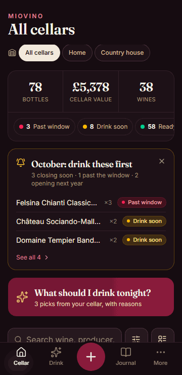
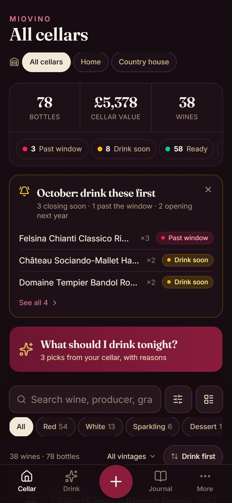
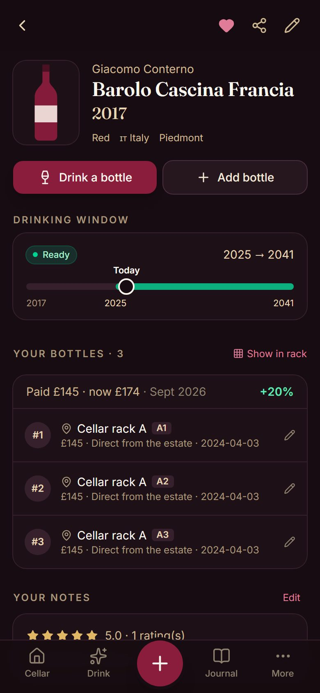
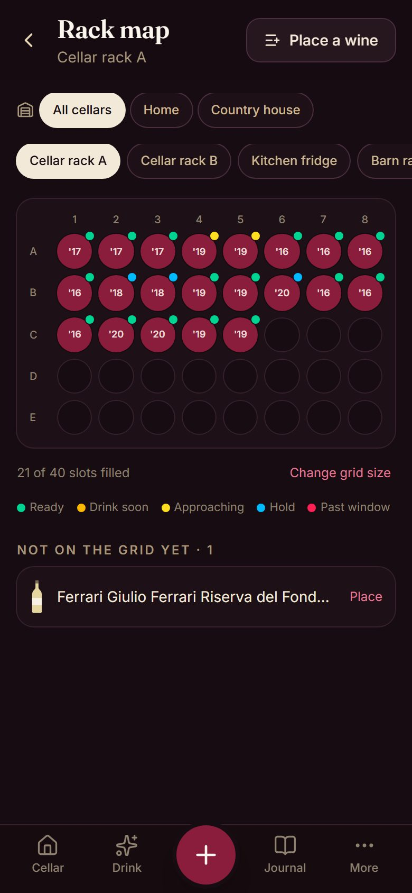
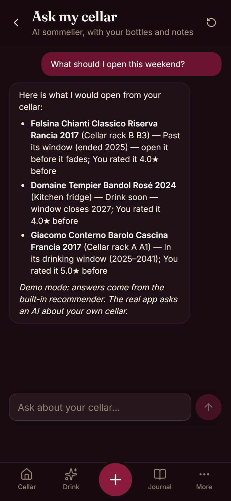
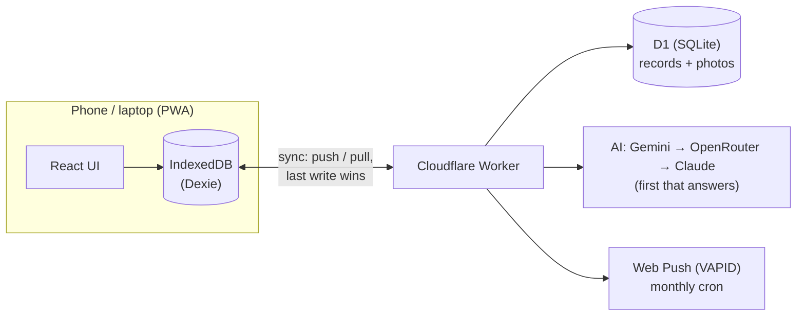

# MioVino 🍷

**A private wine-cellar app that lives on your phone.** Scan a label and AI fills in the wine. See every bottle on a map of your racks, know which ones to open before they fade, and keep a tasting journal. It works offline and syncs across devices.

**▶ [Try the live demo](https://miovino.miovino.workers.dev/demo)**: no sign-up, made-up wines, everything runs in your browser.



<p>
  
  
  
  
</p>

I built it for my own cellar and use it every day. It's an installable PWA, not an app-store app: open the link, "Add to Home Screen", done.

## What it does

| | |
|---|---|
| **Scan a label** | Photo → AI reads producer, vintage, region, grapes and a drinking window. If you already own it, it offers "+1 bottle" instead of a duplicate. Barcode scan for repeat buys. |
| **Rack map** | Lay out each rack as a grid, tap a slot to see the bottle. *Place a wine* suggests slots next to the same wine or producer, and never lets you place more bottles than you own. |
| **What should I drink?** | Rule-based picks that explain themselves ("drink soon, window closes 2027", "you rated it 4.5★", "classic match with lamb"). |
| **Ask my cellar** | Chat with an AI sommelier that knows your bottles, ratings and notes. |
| **Restaurant wine lists** | Photograph the list and get picks that match your taste and budget, each marked **steal / fair / pricey / rip-off** against the usual shop price (or what you paid). |
| **Where to buy & what it costs** | For a wine you own (*Buy again*) or any other (*Find a bottle*): where you bought it before, live UK price links, the AI's typical price, and a dated price history. |
| **Cellar value today** | What the cellar is worth now — your prices, else remembered AI prices, else what you paid. |
| **Journal & Wine DNA** | Half-star ratings, notes, "buy again". Your styles, grapes, regions and producers, by bottles and by rating. |
| **Several cellars** | Home, country house… switch between them; stats follow. |
| **Reminders** | Monthly push notification: what's ready, what's closing soon. |
| **Your data** | Excel/CSV import with messy-data cleanup, full JSON backup, Excel export. English and Italian. |

## How it's built



- **Offline-first.** The UI only reads the on-device database, so it's instant and works with no signal. Every change is timestamped and synced to the Worker in the background (push/pull with a cursor, last write wins, tombstones for deletes).
- **Passkeys, no passwords.** WebAuthn sign-in (Face ID / fingerprint). New devices are added with a one-time QR link.
- **AI behind the server.** Keys never reach the phone. One small fetch-based layer (`worker/ai.ts`) tries free Google Gemini (falling back to its lighter model when busy), then named OpenRouter free models, then Claude, and validates every JSON answer against a zod schema before using it.
- **Wine memory.** Every price and drinking window the AI gives is stored in D1 (`wine_facts`), keyed by producer + wine + vintage regardless of spelling, and reused for 30 days / a year — fewer AI calls, instant answers, and a price history for free.
- **Public copy, automatically.** A workflow republishes this repo after each green merge with personal data rewritten out of the whole history.
- **Shared logic, one source of truth.** Pure TypeScript in `src/shared/` (drinking status, prompts, schemas) is used by both the app and the Worker.
- **Demo mode.** `/demo` swaps in a separate browser database and answers every `/api` call in the browser, so the public demo can never touch real data.

**Stack:** React 19 · TypeScript · Vite · Tailwind CSS 4 · Dexie · Cloudflare Workers + D1 · WebAuthn (SimpleWebAuthn) · Web Push · zod · Vitest · Playwright + axe-core

## Quality

- **Unit and server tests** (Vitest): importer edge cases, sync conflict rules, Worker endpoints running on real SQLite with every migration applied, AI fallback behaviour.
- **End-to-end** (Playwright): real user journeys on the production build, plus an **axe accessibility scan** of the main screens (zero violations).
- **CI/CD** (GitHub Actions): every PR is type-checked, tested and deployed to its own preview with a separate database. Merging to `main` backs up the database, runs migrations and deploys. Nightly backups, with a monthly restore drill.
- **Accessible and mobile-first**: designed at 390px, tap targets ≥ 40px, WCAG AA contrast, screen-reader labels, full Italian translation (a test fails on any untranslated string).

## Run it locally

```bash
npm install
cp .dev.vars.example .dev.vars   # local dev: no sign-in needed
npm run db:migrate:local         # first time: local database
npm run dev                      # app + Worker on http://localhost:5173
npm test                         # unit + server tests
npm run build && npm run e2e     # end-to-end tests
```

Open `http://localhost:5173/demo` for sample data. Deploying your own copy (Cloudflare account, free AI keys, passkeys) is covered in [docs/RELEASE.md](docs/RELEASE.md); the roadmap and decisions are in [PLAN.md](PLAN.md).

## Code map

| Path | What |
|---|---|
| `src/pages/` | Screens |
| `src/lib/db.ts`, `sync.ts` | On-device database and the sync engine |
| `src/lib/importer.ts`, `knowledge.ts` | Spreadsheet import, offline appellation → region/grape knowledge |
| `src/lib/recommend.ts`, `rack.ts` | "What should I drink", rack layout and slot suggestions |
| `src/lib/demo*.ts` | Demo mode: flag, sample cellar, in-browser API |
| `src/shared/` | Logic shared with the Worker (status, AI schemas and prompts) |
| `worker/` | Cloudflare Worker: sync, photos, passkeys, AI, push |
| `migrations/` | D1 schema |
| `e2e/` | Playwright journeys + accessibility scan |
